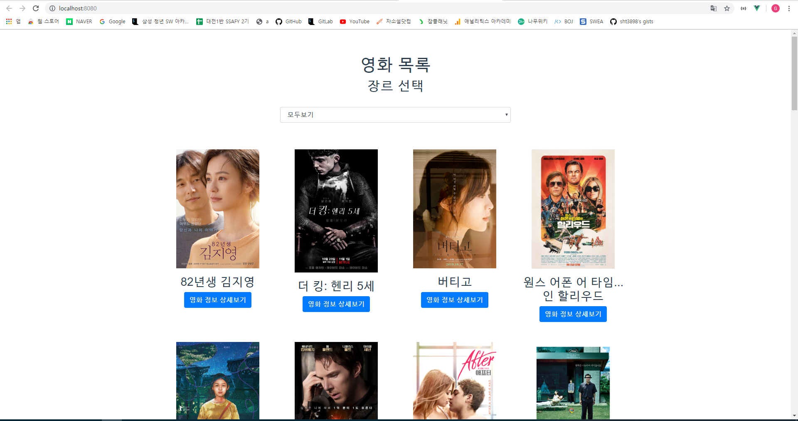
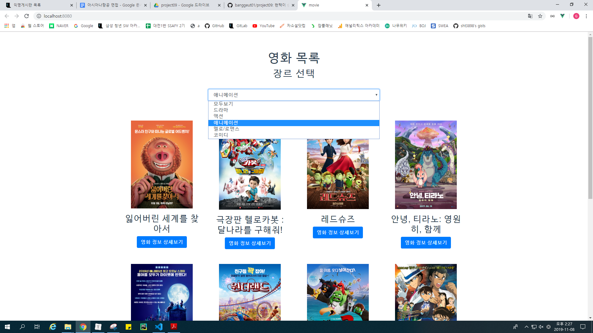
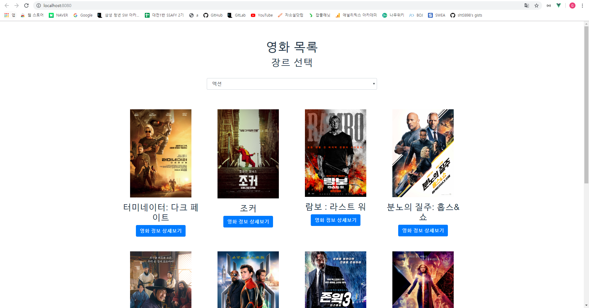
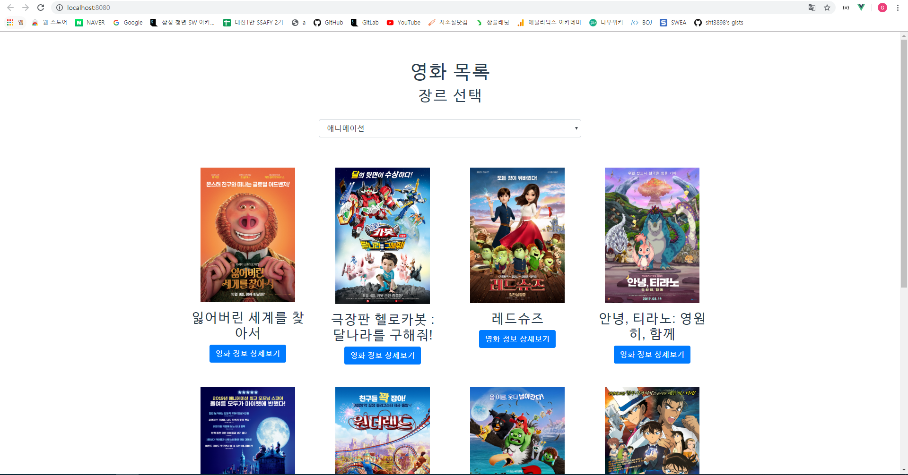

# Project 09 - Vue

```
$ npm install # package.json에 있는 것을 설치
$ npm run serve # 서버 실행
```


## 1. `App.vue`

```html
<template>
  <div id="app">
    <div class="container">
      <!-- 1-3. 호출하시오. 
        필요한 경우 props를 데이터를 보내줍니다.
      -->
      <MovieList :movieList='movies' :genreList='genres'></MovieList>
    </div>
  </div>
</template>

<script>
const axios = require('axios');
// 1-1. 저장되어 있는 MovieList 컴포넌트를 불러오고,
import MovieList from './components/movies/MovieList.vue'

export default {
  name: 'app',
  // 1-2. 아래에 등록 후
  components: {
    MovieList
  },
  data() {
    return {
      // 활용할 데이터를 정의하시오.
      movies : [],
      genres : [],
    }
  },
  mounted() {
    // 0. mounted 되었을 때, 
    // 1) 제시된 URL로 요청을 통해 data의 movies 배열에 해당 하는 데이터를 넣으시오. 
    
    axios.get('https://gist.githubusercontent.com/banggeut01/ef5357321c299b40463be88fcf786e79/raw/d1d9932c72bfb189ad3dd1c058345a41038e826b/movie.json')
                  .then(response =>{
                    this.movies = response.data
                  })
    // 2) 제시된 URL로 요청을 통해 data의 genres 배열에 해당 하는 데이터를 넣으시오.
    axios.get('https://gist.githubusercontent.com/banggeut01/b7555e081d4c0e03f0651b4012d119b9/raw/64e58df2523436467575a1d7b6dc0c6ce82c2538/genre.json')
                  .then(response =>{
                    this.genres = [
                      {id: 0, name: '모두보기'},
                      ...response.data  // ...을 통해 배열을 object로 바꿈(spread 연산자), MovieList에서 분기 대신 사용
                    ]
                  })
    
    console.log(this.movies)
    console.log(this.genres)
    // axios는 위에 호출되어 있으며, node 설치도 완료되어 있습니다.
  },
}
</script>

<style>
#app {
  font-family: 'Avenir', Helvetica, Arial, sans-serif;
  -webkit-font-smoothing: antialiased;
  -moz-osx-font-smoothing: grayscale;
  text-align: center;
  color: #2c3e50;
  margin-top: 60px;
}
</style>

```

* 최상위 컴포넌트로 실행되는 시점에 외부로부터 아래의 데이터를 비동기적으로 받아온다.

  * `axios`를 활용하여 아래의 구조로 되어있는 파일의 형식을 가진 `JSON` 데이터를 받는다.
  * `movies.json`

  * `genres.json`

  * 가져온 데이터는 영화 목록을 구성하는 다음의 컴포넌트로 전달한다.

* `axios`를 통하여 genres를 불러올 때, spread 연산자를 사용하여 모두보기 추가


## 2. `MovieList.vue`

```html
<template>
  <div>
    <h1>영화 목록</h1>
    <h2>장르 선택</h2>
    <!-- 2. 장르 선택(제일 마지막에 구현하시오.)
    2-1. App 컴포넌트로 부터 받은 genres를 반복하여 드롭다운을 완성 해주세요.
    2-2. 드롭다운은 selectedGenreId data와 양방향바인딩(v-model)이 됩니다.
    2-3. 값 변경이 되면, 특정한 함수를 실행 해야합니다.
     -->
    <select class="form-control" v-model="selectedGenreId">
      <option :value="genre.id" v-for="genre in genreList" :key="genre.id">{{genre.name}}</option>
    </select>
      <!-- 1-3. 반복을 통해 호출하시오. 
        필요한 경우 props를 데이터를 보내줍니다.
      -->
      <div class="row">
          <MovieListItem :movie="movie" v-for="movie in filteredMovies" :key="movie.id"></MovieListItem>
      </div>
      <!-- (나중에 마지막으로) selectedGenreId 값에 따른 분기를 해야 합니다.
			분기대신 
       -->
  </div>
</template>

<script>
// 1-1. 저장되어 있는 MovieListItem 컴포넌트를 불러오고,
import MovieListItem from './MovieListItem.vue'

export default {
  name: 'MovieList',
  // 1-2. 아래에 등록 후
  components: {
    MovieListItem
  },
  data () {
    return {
      // 활용할 데이터를 정의하시오.
      selectedGenreId: 0
    }
  },
  // 0. props 데이터를 받이 위하여 설정하시오.
  // genres와 movies 모두 타입은 Array이며, 필수입니다.
  // 설정이 완료 되었다면, 상위 컴포넌트에서 값을 넘겨 주세요.
  // 그리고 적절한 곳에 사용하세요.
  props: {
    movieList : {
      type : Array,
      required : true
    },
    genreList: {
      type: Array,
      required: true
    }
  },
  // 2-3.에서 이야기하는 특정한 함수는 selectedGenreId의 값이 변경될 때마다 호출 됩니다.
  // 드랍다운에서 장르를 선택하면, 해당 영화들만 보여주도록 구현 예정입니다.
  // 주의할 것은 직접 부모 컴포넌트의 데이터를 변경할 수 없다는 점입니다.
  // 완료 후 
  computed: {
    filteredMovies() {
      if (this.selectedGenreId !== 0) {
        return this.movieList.filter(movie => {
          return movie.genre_id === this.selectedGenreId
      })} else {
        return this.movieList
      }
    }
  }
}
</script>

<style>
select {
  display: block;
  width: 50% !important;
  margin: 2rem auto !important;
}
</style>
```

* 영화 목록을 구성하는 컴포넌트이며, 장르에 따라 서로 다른 영화 목록을 출력한다.
* 개별 영화 컴포넌트를 반복하여 배치하는 작업을 진행한다.
* 드롭다운을 통한 장르 선택시 필터링 된 영화들을 실시간으로 변경하여 출력한다.
* 미선택시에는 모든 영화를 출력한다.
* 개별 영화 정보들을 다음의 컴포넌트로 각각 전달한다.


## 3. `MovieListItem.vue`

```html
<template>
  <div class="col-3 my-3">
    <!-- img 태그에 src와 alt값(영화제목)을 설정하시오 -->
    
    
    <!-- 영화 제목을 출력하시오. -->
    <h3>{{movie.name}}</h3>
    <!-- 모달을 활용하기 위해서는 data-target에 모달에서 정의된 id값을 넣어야 합니다. -->
    <button class="btn btn-primary" data-toggle="modal" :data-target="'#movie-'+movie.id">영화 정보 상세보기</button>
    <!-- 1-3. 호출하시오.
      필요한 경우 props를 데이터를 보내줍니다.
      -->
    <MovieListItemModal :movie="movie"></MovieListItemModal>
  </div>
</template>

<script>
// 1-1. 저장되어 있는 MovieListItemModal 컴포넌트를 불러오고,
import MovieListItemModal from "./MovieListItemModal.vue"

export default {
  name: 'MovieListItem',
  // 1-2. 아래에 등록 후
  components : {
    MovieListItemModal
  },
  // 0. props 데이터를 받기 위하여 설정하시오.
  // movie 타입은 Object이며, 필수입니다.
  // 설정이 완료 되었다면, 상위 컴포넌트에서 값을 넘겨 주세요.
  // 그리고 적절한 곳에 사용하세요.
  props : {
    movie : {
      type : Object,
      required : true
    }
  },
  data () {
    // 활용할 데이터를 정의하시오.
    return{}
  }
}
</script>

<style>
.movie--poster {
  width: 200px;
}
</style>
```

* 개별 영화를 포스터/제목/상세보기 버튼으로 구성한 컴포넌트이다.
* 영화 상세보기 버튼을 누르면 `MovieListItemModal.vue`를 확인할 수 있다.
* 해당 영화 정보를 다음의 컴포넌트로 전달한다.


## 4. `MovieListItemModal.vue`

```html
<template>
<!-- vue 콘솔에서 확인하여, 추가 정보들도 출력하세요. -->
<!-- 고유한 모달을 위해 id 속성을 정의하시오. 예) movie-1, movie-2, ... -->
<div class="modal fade" tabindex="-1" role="dialog" :id="'movie-'+movie.id">
  <div class="modal-dialog" role="document">
    <div class="modal-content">
      <div class="modal-header">
        <!-- 영화 제목을 출력하세요. -->
        <h3 class="modal-title">{{movie.name}}</h3>
        <button type="button" class="close" data-dismiss="modal" aria-label="Close">
          <span aria-hidden="true">&times;</span>
        </button>
      </div>
      <div class="modal-body">
        <!-- 영화 설명을 출력하세요. -->
        
        <hr>
        <h5>{{movie.rating}}</h5>
        <br>
        <p>{{movie.description}}</p>
      </div>
      <div class="modal-footer">
        <button type="button" class="btn btn-secondary" data-dismiss="modal">Close</button>
      </div>
    </div>
  </div>
</div>
</template>

<script>
export default {
  name: 'movie-list-item-modal',
  // 0. props 데이터를 받이 위하여 설정하시오.
  // movie 타입은 Object이며, 필수입니다.
  // 설정이 완료 되었다면, 상위 컴포넌트에서 값을 넘겨 주세요.
  // 그리고 적절한 곳에 사용하세요.
  props: {
    movie: {
      type: Object,
      required: true
    }
  }
}
</script>

<style>

</style>
```


* 영화 정보 상세보기를 누르면 보이는 컴포넌트이다.
* 활용 가능한 데이터들을 확인하고, 원하는 위치에 출력한다.


## 5. 결과

* `app.vue`

  

* 장르별 페이지

  

  

  

* MovieListItemModal.vue

  


